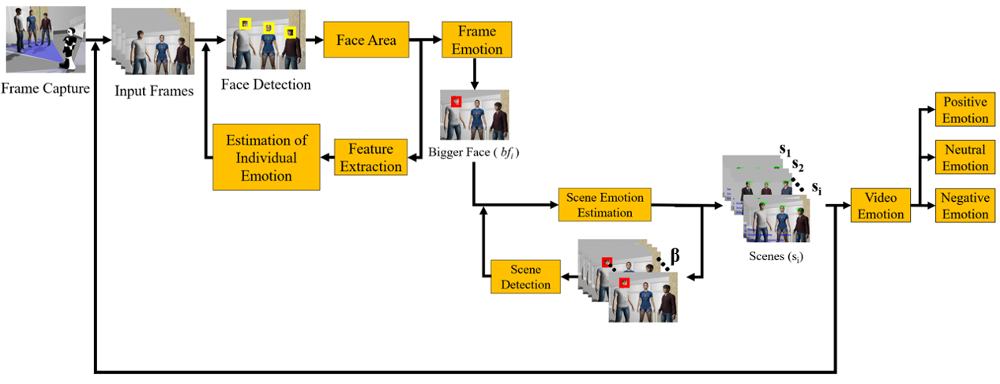
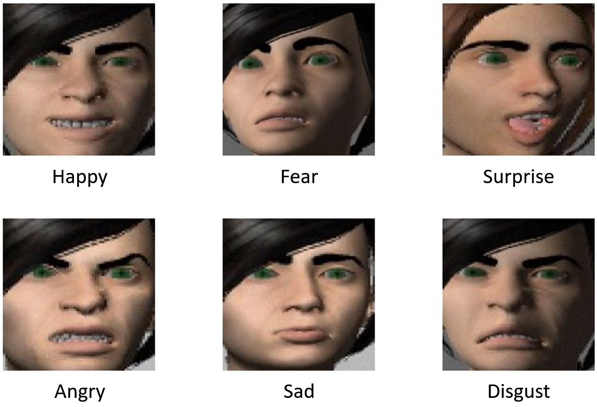
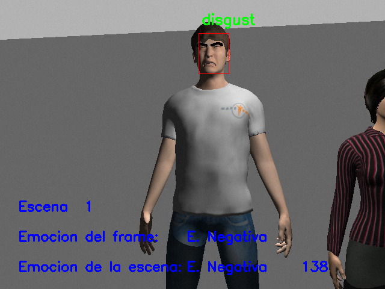

# Group Emotion Detection Based on Social Robot Perception

The objective of this project is to detect group emotions in social environments. For this, emotions are estimated individually, by frame and by scenes. The emotion of a scene represents the emotion of a group of people. With the area of the faces a scene is determined, the faces also serve to determine the emotions. The neural network used in this work was VGGFace, this model was trained to recognize the six basic emotions (happy, sad, fear, angry, disgust, surprise), but the system as a final result determines the emotion of a scene as positive, neutral and negative.

<div align="center">
  
</div>

The final result is shown in the following [Video](https://youtu.be/sabojnDs630). The simulation of the social environment is done on Ubuntu 18.04. This repository includes the implementation of the proposed method in a Google Colab environment, therefore only one video is analyzed to detect group emotions.


## Data Used
The dataset is composed of images and videos, images are classified according to the 6 basic emotions (happy, sad, angry, surprise, disgust, fear) and videos are classified as negative, neutral or positive emotions.

<div align="center">
  
</div>

This dataset was generated in ROS/Gazebo, this data can be found [here](https://github.com/marco-quiroz/Dataset-in-ROS).

## Implementation in Google Colab

- To perform group emotion detection, three files need to be uploaded. The first two files are needed to detect faces. And the third file contains the weights of the VGGFace pretrained network, this file can be found at this [link](https://drive.google.com/file/d/1r-3oluA833Qg4tn_VGOqM51wGTxoggYg/view?usp=share_link).

- In the notebook [NN_ROS_Emotions.ipynb](https://drive.google.com/file/d/1bEwHFXNVjBaIasJLGC8vYHSqkS8pdq2z/view?usp=share_link), the detection of group emotions is performed. When uploading a video you will see the following results: individual emotions, frame emotion, scene emotion and scene.

<div align="center">
  
</div>

## Implementation in ROS
### Requeriments

- ROS Melodic
- Ubuntu 18.04.5
- Python 3.6.9
- Tensorflow 2.6.2
- OpenCV 4.6.0
- tqdm
- imutils

### Installation

```
sudo apt-get install python3-pip python-catkin-tools python3-dev python3-numpy 

sudo pip3 install rospkg catkin_pkg
```

## Citation
If you use our code or models in your research, please cite with:
```
@article{quiroz2022group,
  title={Group emotion detection based on social robot perception},
  author={Quiroz, Marco and Pati{\~n}o, Raquel and Diaz-Amado, Jos{\'e} and Cardinale, Yudith},
  journal={Sensors},
  volume={22},
  number={10},
  pages={3749},
  year={2022},
  publisher={MDPI}
}
```

## Acknowledgments
This research was supported by the FONDO NACIONAL DEDESARROLLO CIENTÍFICO, TECNOLÓGICO Y DE INNOVACIÓN TECNOLÓGICA - FONDECYT as executing entity of CONCYTEC under grant agreement no.01-2019-FONDECYT-BM-INC.INV in the project RUTAS: Robots for Urban Tourism,Autonomous and Semantic web based.
